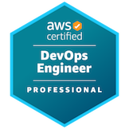

# 👨‍💻 Agustin Magliano

**`Principal Software Engineer`**

<!-- Temporarily commented due to errors -->
<!--  -->

## 🚀 Skills

  

## ⭐ Certifications

<!--START_SECTION:badges-->
<!--END_SECTION:badges-->

